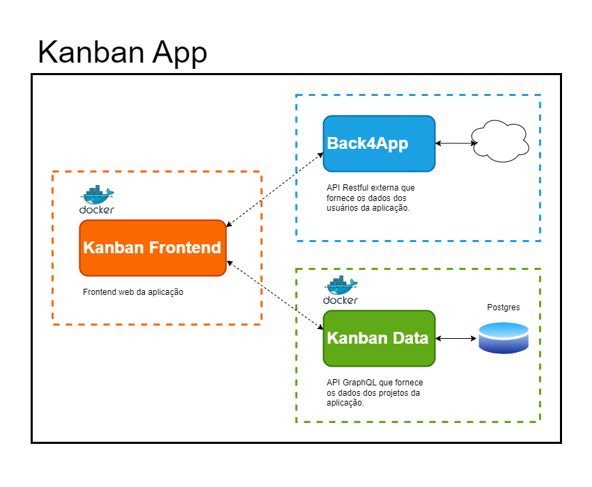

# Kanban MS (Micro Services) 


> Projeto de implantação por meio de orquestração com Docker Compose. O propósito deste projeto é realizar a implantação local dos micro-serviços: "kanban-frontend" e "kanban-data", ambos encontrados nesse repositório, além de configurá-los para utilizar o serviço de gerenciamento de usuários externo, o Back4app (disponível em https://back4app.com). Esses três micro-serviços fazem parte da aplicação web de gestão de projetos baseada no método Kanban. 

> Projeto de implantação desenvolvido como uma parte do trabalho de conclusão do terceiro e último módulo - Desenvolvimento Backend Avançado - da Pós-Graduação em Desenvolvimento FullStack da PUC-RIO. 

## Todo

- [ ] Separar projetos em repositórios git diferentes
- [ ] Desenvolver API Gateway (Apollo Federation)
- [ ] Substituir o Back4app pelo projeto open source Parse Server - https://github.com/parse-community/parse-server

## 💻 Pré-requisitos

Antes de começar, verifique se o seu ambiente atende aos seguintes requisitos:

* `Docker`

> Instalação do docker: https://docs.docker.com/engine/install/

* `Conta no BaaS - Back4app`

> Você precisa criar uma conta gratuita no Back4app (https://back4app.com) e recuperar as seguintes Keys:

```
APPLICATION_ID
RESTAPIKEY
```

> As Keys estão disponíveis na dashboard administrativa em "App Settings" > "Security & Keys"

## 🚀 Rodando

Faça clone do projeto:
```
git clone https://github.com/bpbastos/kanban-ms.git
```

Acesse o diretório do projeto com:
```
cd kanban-ms
```

Crie um arquivo .env no diretório raiz do projeto com as seguintes variáveis:
> Substituia as variaveis BACK4APP_APPID e BACK4APP_RESTAPIKEY com as keys da sua conta no Back4app

```env
#Back4app
BACK4APP_URL=https://parseapi.back4app.com
BACK4APP_APPID=chave-appid-do-back4app
BACK4APP_RESTAPIKEY=chave-restapikey-do-back4app

#API GraphQL
KANBANDATA_URL=http://localhost:8000/graphql

#Postgres
POSTGRES_HOST=db
POSTGRES_USER=kanban
POSTGRES_PASSWORD=kanbanpass
POSTGRES_DB=kanban

#Frontend
KANBANFRONT_URL=http://localhost:3000
NUXT_SECRET=chave-com-32-caracteres
```

No diretório raiz, execute:
```sh
docker compose up -d
docker exec --env-file ./.env data python create_db.py
```

Abra o endereço http://localhost:3000 no seu navegador.