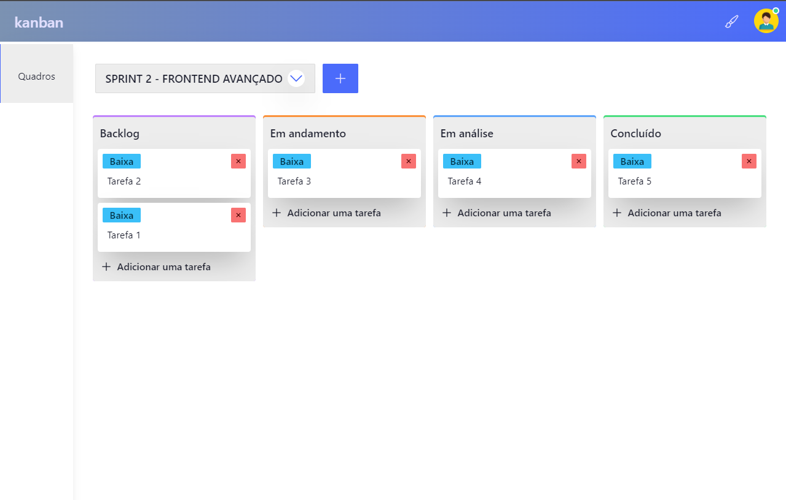

# Kanban  Frontend 


> Frontend para a aplicação web de gerenciamento de projetos usando o método Kanban. Este frontend foi construído utilizando as tecnologias Nuxt 3, Vue 3, Tailwind CSS e DaisyUI, e se integra com duas APIs distintas. Uma delas é uma API RESTful responsável pelo gerenciamento de usuários, fornecida pelo serviço de BaaS (Backend As A Service) oferecido pelo provedor https://www.back4app.com/. A segunda API é uma API GraphQL fornecida pelo serviço kanban-data que você encontra nesse mesmo repositório.

> Este frontend foi desenvolvido como uma parte do trabalho de conclusão do terceiro e último módulo - Desenvolvimento Backend Avançado - da Pós-Graduação em Desenvolvimento FullStack da PUC-RIO. 


## Funcionalidades

- [x] Listar quadros.
- [x] Criar tarefa.
- [x] Editar tarefa.
- [x] Excluir tarefa.
- [x] Adicionar sub tarefas.
- [x] Implementar backend real.
- [x] Login de usuário.
- [x] Registro de usuários.
- [x] Criar novo quadro.
- [x] Gerenciador de temas
- [x] Sistema de notificação.

## Todo

- [ ] Arquivar quadros.
- [ ] Criar/Editar/Arquivar workflows|status.
- [ ] Arquivar tarefas.
- [ ] Reordenar tarefas.
- [ ] Reordenar sub tarefas.
- [ ] Arrastar tarefas entre workflows|status.
- [ ] Layout Responsivo no mobile.
- [ ] Validação nos formulários.
- [ ] Tratamento de erro para consultas graphql
- [ ] Exibir/Editar informações do perfil de usuário.


## 💻 Pré-requisitos

Antes de começar, verifique se o seu ambiente atende aos seguintes requisitos:

> ATENÇÃO, este frontend requer que os serviços de gerenciamento de usuários (Back4app) e de dados (Kanban-Data) estejam em execução antes de iniciar. Recomendo seguir as instruções contidas no README do repositório de implantação - https://github.com/bpbastos/kanban-ms - para garantir uma configuração adequada.

* `Docker`

> Instalação do docker: https://docs.docker.com/engine/install/

## 🚀 Rodando

Crie um arquivo .env na raiz do diretório kanban-frontend com as seguintes variáveis:

```env
BACK4APP_URL=https://parseapi.back4app.com
BACK4APP_APPID=chave-appid-do-back4app
BACK4APP_RESTAPIKEY=chave-restapikey-do-back4app
KANBANDATA_URL=url-do-servico-graphql-kanbandata
NUXT_SECRET=chave-com-32-caracteres
```

No diretório kanban-frontend em um terminal, execute:
```sh
docker build -t kanban-frontend:1.0 .
docker run -d --env-file ./.env -p 3000:3000 --name frontend kanban-frontend:1.0 
```

Abra o endereço http://localhost:3000/ no seu navegador.